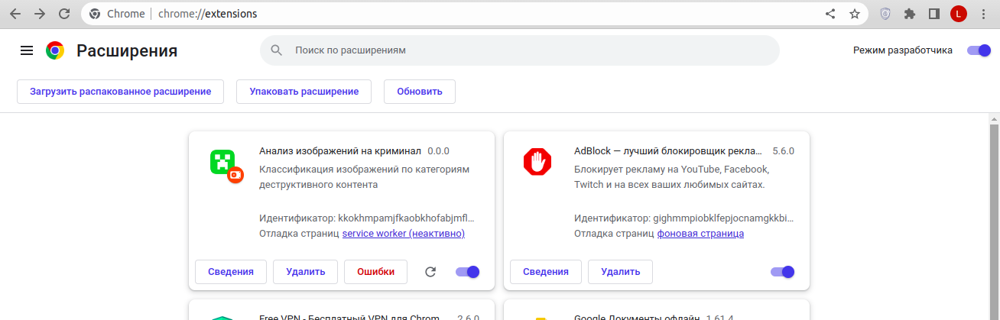
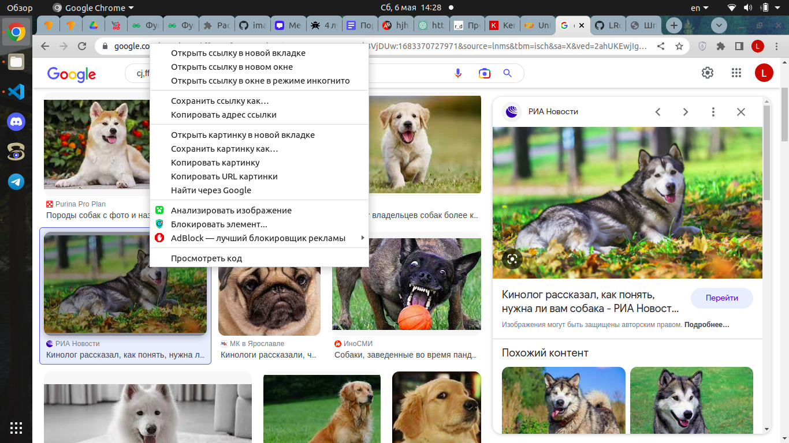
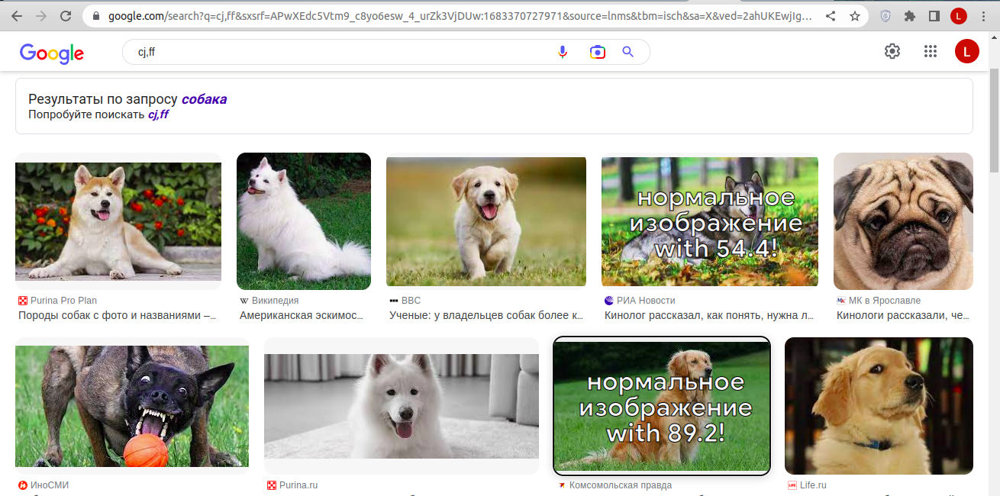

# ВКР на тему: Разработка средства визуализации и мониторинга криминального контента из туманной вычислительной среды

## Загрузка расширения
Клонируйте или скачайте этот репозиторий.  
1. Перейдите в каталог chrome-extension : cd ./chrome-extension
2. Установите зависимости: yarn install
3. Запустите скрипт сборки: yarn build  

После запуска скрипта сборки вы должны увидеть следующие новые файлы:
1. dist/src/content.js
2. dist/src/service_worker.js
3. dist/src/service_worker.js.map

Затем перейдите в папку server: cd ../server  
1. Устновите зависимости: npm install
2. Запустите сервер: node app.js

## Установите расширение в Chrome:
1. В браузере Chrome перейдите на chrome://extensions .
2. Включите режим разработчика с помощью переключателя в правой части браузера.
3. Выберите Загрузить распакованное расширение и выберите criminalContent_monitor/chrome-extension/dist

Вы должны увидеть новую карточку в расширении Chrome.  

## Как использовать расширение:
 **Предупреждение! Точность классификации 92%, могут быть ошибки!**  
*классификация происходит по 5 классам (алкоголь/наркотики/порнография/оружие/нормальное изображение), на экран выводится результат, в котором модель уверена больше всего  
1. Наведите курсор мыши на любое изображение и щёдкните правой кнопкой
2. В списке функций выберите "Анализировать изображение"

3. Вы получите следующий вывод:

